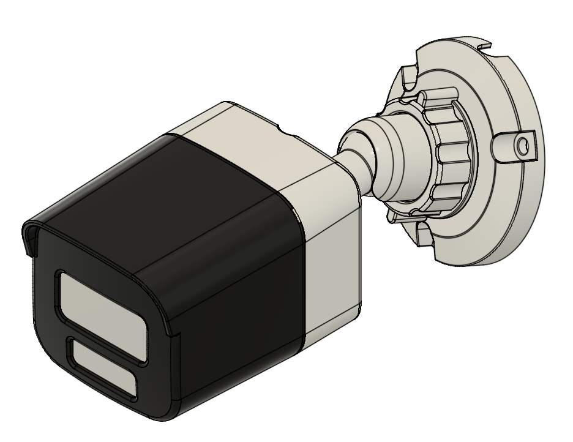

# Anisca Vision Camera Scripts


Software suite for the **Anisca Vision AVI-1-1** OpenWRT camera system.



## Quick Start

Run this command on your AVI-1-1 camera:

```bash
curl -fsSL "https://install.anisca.io?$(date +%s)" | sh
```

Alternative (uncached):
```bash
curl -fsSL "https://raw.githubusercontent.com/o16s/avi_scripts/main/install.sh" | sh
```

## Features

- **Automated Azure Blob Storage uploads** with configurable intervals
- **Live video streaming** via web interface
- **Privacy polygon masking** for sensitive areas  
- **LuCI web interface integration** with camera controls
- **Local analytics** including motion detection and brightness metrics

## Documentation

📖 **[Complete User Manual](https://o16s.github.io/avi_scripts/)**

## Troubleshooting

**LuCI camera page not appearing:**
```bash
rm -rf /tmp/luci-*
/etc/init.d/uhttpd restart
```
Then logout and log back into LuCI.

> **Note:** Services page conflicts can occur with duplicate lua controller files.

## BB-400 Gateway (MQTT Broker)

Install the NanoMQ MQTT broker on a BB-400 industrial gateway:

```bash
curl -fsSL https://raw.githubusercontent.com/o16s/avi_scripts/main/bb400_gateway/install.sh | sh
```

This sets up a Docker-based NanoMQ broker with auto-generated credentials at `/opt/avi-gateway/`. Re-run the same command to update configuration while preserving existing credentials.

## Offline Deployment

For cameras without internet access, use `deploy.sh` from a local machine:

```bash
./deploy.sh --fetch-packages          # download .ipk packages once
./deploy.sh root@192.168.1.100        # deploy to camera over SSH
```

## Support

- Email: support@octanis.ch
- Website: https://www.octanis.ch/anisca-vision-openwrt-camera